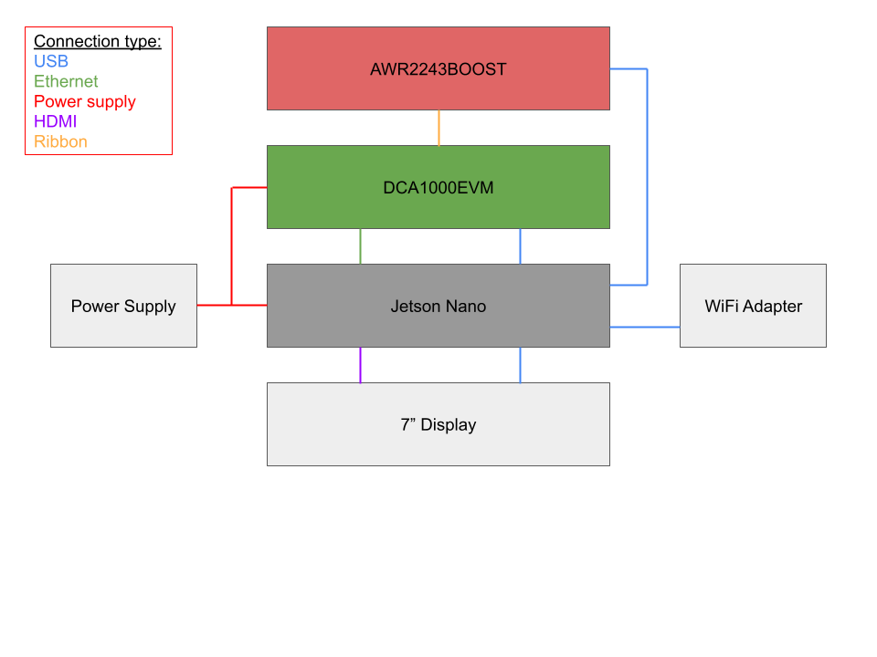

# NVIDIA Jetson Nano Configuration

Radar Node Wiring             |  Assembled Radar Node
:-------------------------:|:-------------------------:
  |  

A few additions to Jetson Linux (Ubuntu 20.04) are required for this project. These include the following drivers and libraries:

- [WiFi connection](https://www.amazon.com/dp/B07TFT876R?psc=1&ref=ppx_yo2ov_dt_b_product_details)
- [SSH Server]
- [Firewall]
- [FTDI drivers]()
- [CMake](https://cmake.org/)
- [OpenCV](https://opencv.org/)
- [Github SSH keys](https://docs.github.com/en/authentication/connecting-to-github-with-ssh/adding-a-new-ssh-key-to-your-github-account)
- [DCA CLI](https://github.com/Real-Time-MIMO/mmwaveAPI)
- [mmWaveLink](https://github.com/Real-Time-MIMO/openradar_mmwave_utils)
- [Our Github repositories](https://github.com/Real-Time-MIMO)

In order to configure the Jetson Nano with this software, there are two options. (1) Running a shell script with all installation commands or (2) flashing an SD card with the pre-prepared Linux image. The first option is better if you want to have the most updated version of Jetson Linux and additional software. The second option is better if you want to guarantee everything works out of the box without any hassle. The first approach is suggested because it configures the Github SSH keys independently for each node. After each Jetson has been configured, you must change their static IP addresses to avoid network confusion.

## (Option 1) Shell Script

1. Flash an SD card (>= 128GB reccomended) with the official [Jetson Nano Deloper Kit SDK](https://developer.nvidia.com/embedded/l4t/r32_release_v7.1/jp_4.6.1_b110_sd_card/jeston_nano/jetson-nano-jp461-sd-card-image.zip) using [these instructions](https://developer.nvidia.com/embedded/learn/get-started-jetson-nano-devkit#write). We reccomend using the command line instructions on MacOS. The specific image that we used in this process is provided (Google Drive).
2. Insert the SD card into the Jetson and power.
3. Go through the initial setup process.
4. Get the shell script `jetsonconfig.sh` on the Jetson via USB drive and place it on the Desktop. Eject the drive.
5. Plug in the WiFi adapter
6. Open a terminal and run this command while in the Naples  EE Capstone Lab `cd Desktop; chmod +x jetsonconfig.sh; ./jetsonconfig.sh` (the script contains detailed information on each installation step)
7. Follow the instructions given by the script.
8. Run `rm jetsonconfig.sh; cd`

## (Option 2) Flash the Pre-Prepared Image

1. Follow [these instructions](https://developer.nvidia.com/embedded/learn/get-started-jetson-nano-devkit#write) for flashing the SD card, except use `JetsonImage_X.X.zip` (Google Drive) instead of `jetson_nano_devkit_sd_card.zip`
2. Insert the SD card into the Jetson and enjoy!

## Extra Configuration Steps

- The script configures the Github user as `fusionsense@gmail.com`. You may also choose to add extra Linux users with their own Github accounts. We suggest using multiple users / accounts for development and the team user / account for demonstrations.
- You must still configure Github, CMake and OpenCV on your personal computer if you plan to use it as the server
